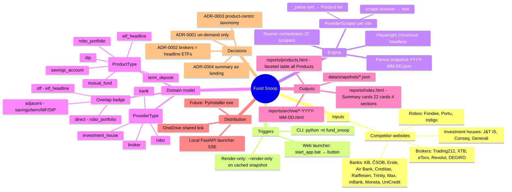
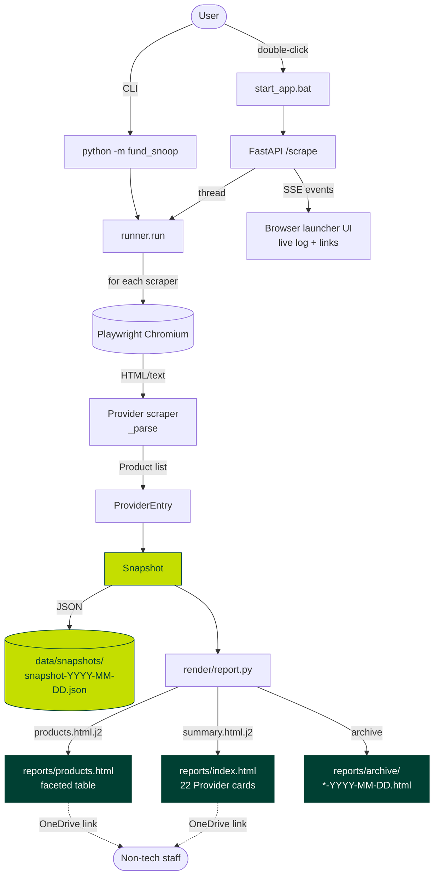
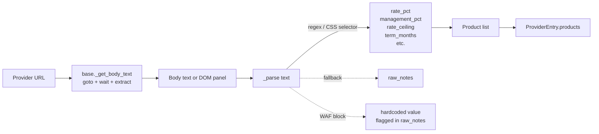
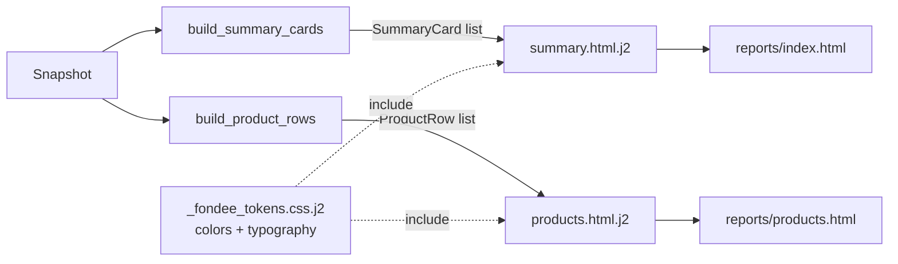

# [[Name|Fund Snoop]] — Mind map

How the app works, end to end. See [[About]] for scope, [[Tech stack]] for stack rationale, [[Status]] for current phase.

## Conceptual mind map

## Data flow

## Scraper anatomy (one Provider)

Patterns: see [[About#Scope]]. Reference scrapers per pattern documented in repo `HANDOVER.md` § Pickup checklist.

## Renderer split (Phase F)

## Cross-links

- [[Index]] — MOC for this folder
- [[About]] — use case + scope + phase plan
- [[Tech stack]] — Python + Playwright + Jinja2 + FastAPI rationale
- [[Status]] — current phase + live data verdicts (stale — repo `HANDOVER.md` authoritative)
- [[Known issues]] — per-provider scraper accuracy
- [[Pickup checklist]] — next-session tasks
- [[Name|Fund Snoop]] — name decision

### Concepts hub

- [[Provider]] · [[ProviderType]] · [[Product]] · [[ProductType]] · [[FeeSchedule]] · [[Minimum]] · [[Performance]] · [[Snapshot]] · [[Report]] · [[Summary]] · [[Overlap]]

### Decisions

- [[ADR-0001 on-demand only]] · [[ADR-0002 broker scope]] · [[ADR-0003 product-centric taxonomy]] · [[ADR-0004 summary as landing]]

### Modules

- [[Module - schema]] · [[Module - runner]] · [[Module - providers base]] · [[Module - render report]] · [[Module - web app]] · [[Module - cli]] · [[Module - paths]]

## Source of truth

Authoritative live state in repo: `c:\Users\miroslav.zachar\OneDrive - Direct\Projects\Scrapping\HANDOVER.md`. This map is logical; HANDOVER tracks Phase + open backlog.
